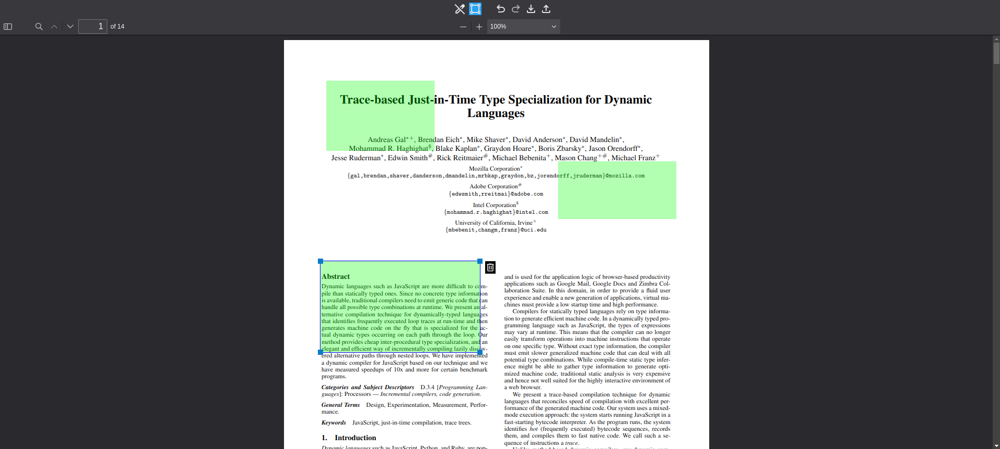

# Demo
demo page  
https://condt.github.io/pdf-square-annotation/demo.html  



# Example
```sh
npm run dev
```

# API
see [global.d.ts](./src/types/global.d.ts)

# Features
* draw/edit square annotation
* undo/redo
* export squares(JSON)
* import squares(JSON)
* lock squares
* scroll to square

# How to install in your project
Copy the following into your project.
* build
* pdfjs
* LICENSE

Call it in an iframe.
```html
<iframe src="The path of the copied build/index.html"></iframe>
```

# Dependencies
* [PDF.js](https://github.com/mozilla/pdf.js) v5.4.54
* [Material Icons](https://fonts.google.com/icons)
