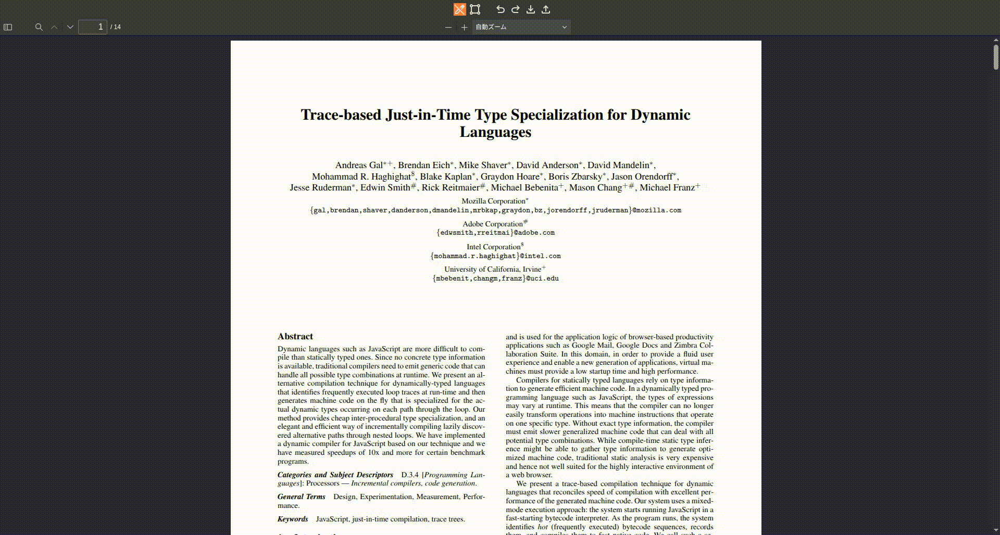

# Features
* draw/edit square annotation
* undo/redo
* export squares(JSON)
* import squares(JSON)

# Usage Example
1. serve repository root
2. open `/example/index.html`

See the example directory for details.

# How to install in your project
run build.
```sh
npm run build
```

Copy the following into your project.
* dist
* pdfjs
* LICENSE

Call it in an iframe.
```html
<iframe src="The path of the copied dist/index.html"></iframe>
```

# Dependencies
* [PDF.js](https://github.com/mozilla/pdf.js) v5.4.54
* [Material Icons](https://fonts.google.com/icons)
